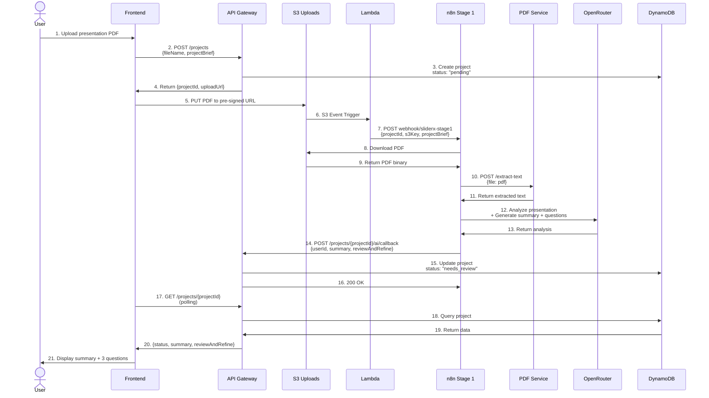
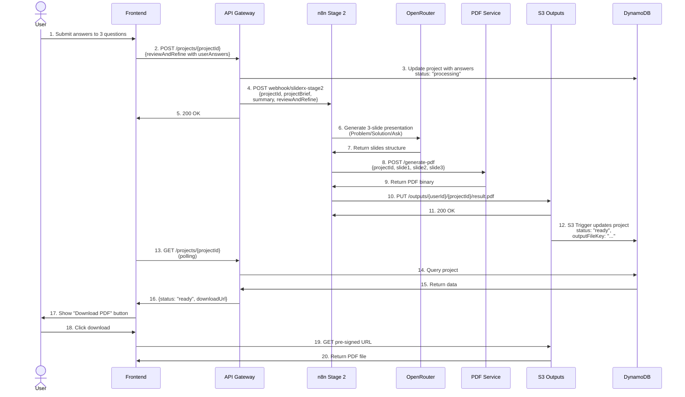
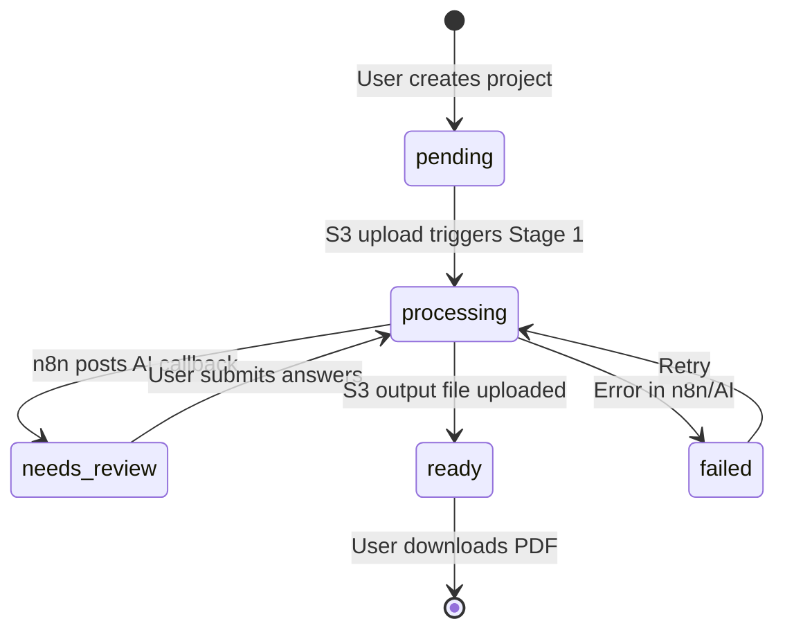

# SlideRx Complete Flow Diagram

## Overview Architecture

```mermaid
graph TB
    subgraph "Frontend (React)"
        UI[User Interface]
    end

    subgraph "AWS Infrastructure"
        API[API Gateway]
        Lambda[Lambda Functions]
        S3Upload[S3: sliderx-uploads-dev]
        S3Output[S3: sliderx-outputs-dev]
        DDB[(DynamoDB)]
    end

    subgraph "n8n Workflows (Docker)"
        N8N_S1[n8n Stage 1<br/>Webhook]
        N8N_S2[n8n Stage 2<br/>Webhook]
        PDF_SVC[PDF Services<br/>FastAPI]
    end

    subgraph "External Services"
        OpenRouter[OpenRouter API<br/>Claude Sonnet 4]
    end

    UI -->|1. POST /projects| API
    API -->|2. Pre-signed URL| UI
    UI -->|3. Upload PDF| S3Upload
    S3Upload -->|4. Trigger| Lambda
    Lambda -->|5. Webhook POST| N8N_S1
    N8N_S1 -->|6. Extract PDF| PDF_SVC
    N8N_S1 -->|7. AI Analysis| OpenRouter
    N8N_S1 -->|8. POST /ai/callback| API
    API -->|9. Update| DDB
    UI -->|10. GET /projects/{id}| API
    API -->|11. Return status| UI

    UI -->|12. POST /projects/{id}<br/>with answers| API
    API -->|13. Webhook POST| N8N_S2
    N8N_S2 -->|14. AI Generate| OpenRouter
    N8N_S2 -->|15. Create PDF| PDF_SVC
    N8N_S2 -->|16. Upload result.pdf| S3Output
    S3Output -->|17. Trigger Update| DDB
    UI -->|18. Poll & Download| API
```

---

## Stage 1: Extraction & Review Preparation



### Stage 1 Data Flow Details

**Lambda → n8n Webhook Input:**
```json
{
  "projectId": "uuid",
  "s3Bucket": "sliderx-uploads-dev",
  "s3Key": "uploads/{userId}/{projectId}/presentation.pdf",
  "projectBrief": {
    "successMetric": "string",
    "industry": "string",
    "problemSolved": "string"
  }
}
```

**n8n → API Callback Output:**
```json
{
  "userId": "string",
  "summary": {
    "slides": [
      {
        "index": 1,
        "title": "Slide Title",
        "bullets": ["Point 1", "Point 2", "Point 3"]
      }
    ]
  },
  "reviewAndRefine": [
    {
      "id": "targetAudience",
      "type": "select",
      "label": "Who is this presentation primarily aimed at?",
      "options": ["Investors", "Potential customers", "Internal leadership", "Strategic partners"],
      "required": true,
      "userAnswer": ""
    },
    {
      "id": "coreMessage",
      "type": "longText",
      "label": "What is the key message or takeaway you want the audience to remember?",
      "required": true,
      "userAnswer": ""
    },
    {
      "id": "businessGoal",
      "type": "select",
      "label": "What best describes your main business goal for this presentation?",
      "options": [
        "Fundraising / attracting investors",
        "Product launch or marketing",
        "Internal alignment and strategy",
        "Client acquisition or sales enablement"
      ],
      "required": true,
      "userAnswer": ""
    }
  ]
}
```

---

## Stage 2: Final Generation



### Stage 2 Data Flow Details

**API → n8n Webhook Input:**
```json
{
  "projectId": "uuid",
  "userId": "string",
  "s3Key": "uploads/{userId}/{projectId}/presentation.pdf",
  "projectBrief": {
    "successMetric": "string",
    "industry": "string",
    "problemSolved": "string"
  },
  "summary": {
    "slides": [...]
  },
  "reviewAndRefine": [
    {
      "id": "targetAudience",
      "userAnswer": "Investors"
    },
    {
      "id": "coreMessage",
      "userAnswer": "We solve X problem with Y solution..."
    },
    {
      "id": "businessGoal",
      "userAnswer": "Fundraising / attracting investors"
    }
  ]
}
```

**n8n → PDF Service Output:**
```json
{
  "projectId": "uuid",
  "slide1": {
    "title": "THE PROBLEM",
    "visual": "Description of visual element",
    "sentence": "One impactful sentence"
  },
  "slide2": {
    "title": "THE SOLUTION",
    "visual": "Description of visual element",
    "sentence": "One impactful sentence"
  },
  "slide3": {
    "title": "THE ASK",
    "visual": "Description of visual element",
    "sentence": "One impactful sentence"
  }
}
```

---

## Status Progression



---

## System Components

### **Frontend (React/Next.js)**
- User uploads PDF via pre-signed S3 URL
- Polls API for status changes
- Displays AI-generated questions
- Shows final PDF download link

### **AWS Infrastructure**
- **API Gateway**: REST API endpoints (`/projects`, `/projects/{id}`, `/ai/callback`)
- **Lambda**: S3 event triggers for Stage 1 & Stage 2
- **S3 Buckets**:
  - `sliderx-uploads-dev` (input PDFs)
  - `sliderx-outputs-dev` (generated 3-slide PDFs)
- **DynamoDB**: Project state storage

### **n8n Workflows**
- **Stage 1**: PDF extraction → AI analysis → Post callback
- **Stage 2**: AI generation → PDF creation → S3 upload
- **PDF Services**: FastAPI microservice (text extraction & PDF generation)

### **External Services**
- **OpenRouter API**: Claude Sonnet 4 for AI processing
- **ngrok**: Public webhook access for local n8n

---

## API Endpoints Summary

| Endpoint | Method | Used By | Purpose |
|----------|--------|---------|---------|
| `/projects` | POST | Frontend | Create project + get upload URL |
| `/projects` | GET | Frontend | List user's projects |
| `/projects/{id}` | GET | Frontend | Get project status (polling) |
| `/projects/{id}` | POST | Frontend | Submit review answers (triggers Stage 2) |
| `/projects/{id}/ai/callback` | POST | n8n Stage 1 | Post extraction results |

---

## Configuration Requirements

### **n8n Webhooks (via ngrok)**
- Stage 1: `https://{ngrok-url}.ngrok-free.dev/webhook/sliderx-stage1`
- Stage 2: `https://{ngrok-url}.ngrok-free.dev/webhook/sliderx-stage2`

### **n8n Credentials**
1. **AWS S3** - Access to both buckets
2. **OpenRouter API** - Bearer token for AI calls
3. **API Gateway** - Base URL for callbacks

### **Docker Network**
- n8n → PDF Services: `http://pdf-services:8000`
- External → n8n: ngrok public URL

---

## Error Handling

**Potential Failure Points:**
1. S3 upload fails → User retries from frontend
2. n8n webhook timeout → Lambda retries (3 attempts)
3. PDF extraction fails → n8n returns error, API marks as `failed`
4. AI API rate limit → n8n implements exponential backoff
5. PDF generation fails → n8n logs error, API marks as `failed`

**Recovery:**
- Frontend polls status and shows error messages
- User can retry from last successful step
- n8n logs all errors for debugging

---

## Key Simplifications (per Victor)

✅ **n8n only makes ONE API call** in Stage 1 (`/ai/callback`)
✅ **S3 triggers handle** DynamoDB updates automatically
✅ **No callback needed** from n8n in Stage 2 (S3 handles it)
✅ **Lean payloads** - minimal data transfer between systems
